# 🤖 AI Trading Agent - AI自主交易智能体系统

[](https://www.python.org/)
[](https://www.djangoproject.com/)
[](https://reactjs.org/)
[](https://www.typescriptlang.org/)
[](LICENSE)

基于 **六层认知架构** 的 AI 自主交易智能体系统，具备市场感知、记忆存储、策略规划、智能决策、自动执行和自我反思能力。

---

## 📋 目录

- [系统特性](#-系统特性)
- [技术架构](#-技术架构)
- [快速开始](#-快速开始)
- [项目结构](#-项目结构)
- [核心功能](#-核心功能)
- [使用指南](#-使用指南)
- [开发文档](#-开发文档)
- [常见问题](#-常见问题)

---

## ✨ 系统特性

### 🧠 六层认知架构

1. **感知层 (Perception)** - 多源市场数据采集与分析
2. **记忆层 (Memory)** - 向量数据库 + 知识图谱长期记忆
3. **规划层 (Planning)** - LLM驱动的智能交易计划生成
4. **决策层 (Decision)** - 多智能体辩论机制（激进/保守/量化/裁判）
5. **执行层 (Execution)** - 自动化交易执行与风控
6. **反思层 (Reflection)** - 交易复盘与策略进化

### 🔥 核心能力

- ✅ **自主学习** - 从历史交易中学习并不断优化
- ✅ **策略进化** - 基因算法驱动的策略自然选择
- ✅ **风险控制** - 动态止损止盈与仓位管理
- ✅ **实时监控** - Web可视化面板实时监控
- ✅ **多账户支持** - 实盘/模拟盘并行运行
- ✅ **多数据源** - Tushare/AKShare/Yahoo Finance/Alpha Vantage

---

## 🏗️ 技术架构

### 后端 (Backend)

```
Django 4.2 + Django REST Framework
├── 🗄️ 数据层: SQLite/PostgreSQL
├── 🔌 API层: RESTful API + Swagger文档
├── 🧠 智能层: OpenAI GPT + ChromaDB向量库
├── 📊 数据采集: Tushare/AKShare/Yahoo/Alpha Vantage
└── ⚙️ 任务调度: Django Management Commands
```

### 前端 (Frontend)

```
React 18 + TypeScript + Ant Design
├── 🎨 UI框架: Ant Design 5
├── 📊 图表库: Recharts
├── 🔄 状态管理: Zustand
├── 🌐 路由: React Router 6
└── 📡 HTTP: Axios
```

---

## 🚀 快速开始

### 1. 后端启动

```bash
cd server

# 安装依赖
pip install -r requirements.txt

# 数据库迁移
python manage.py migrate

# 加载Mock数据（可选）
./load_mock_data.sh

# 启动后端服务器
python manage.py runserver 0.0.0.0:8000
```

### 2. 启动AI智能体（可选）

```bash
cd server

# 启动所有智能体（自动交易）
./start_all_agents.sh

# 停止所有智能体
./stop_all_agents.sh
```

### 3. 前端启动

```bash
cd web

# 安装依赖
npm install

# 启动前端
npm run dev
```

### 访问系统

- **前端**: http://localhost:3000
- **后端API**: http://localhost:8000/api/
- **Admin后台**: http://localhost:8000/admin/
- **默认账号**: `admin / admin123456`

---

## 📂 项目结构

```
Trade/
├── server/                          # Django后端
│   ├── apps/                        # Django应用
│   │   ├── agents/                  # 智能体模块
│   │   ├── market_data/            # 市场数据
│   │   ├── strategies/             # 策略管理
│   │   ├── trades/                 # 交易模块
│   │   ├── memory/                 # 记忆系统
│   │   ├── reports/                # 报告系统
│   │   └── docs/                   # 文档API
│   ├── services/                   # 业务逻辑层
│   │   ├── agents/                 # 六层智能体实现
│   │   │   ├── perception.py      # 感知层
│   │   │   ├── memory.py          # 记忆层
│   │   │   ├── planning.py        # 规划层
│   │   │   ├── decision.py        # 决策层
│   │   │   ├── execution.py       # 执行层
│   │   │   └── reflection.py      # 反思层
│   │   ├── data_collectors/       # 数据采集器
│   │   └── utils/                 # 工具类
│   ├── core/                       # Django核心配置
│   ├── mock/                       # Mock测试数据
│   ├── manage.py                   # Django管理脚本
│   ├── requirements.txt            # Python依赖
│   ├── AI_TRADER_README.md        # 后端详细文档
│   └── start_all_agents.sh        # 智能体启动脚本
│
├── web/                            # React前端
│   ├── public/                     # 静态资源
│   ├── src/
│   │   ├── components/            # 通用组件
│   │   │   └── Layout/           # 布局组件
│   │   ├── pages/                # 页面组件
│   │   │   ├── Dashboard/        # 📊 仪表板（完整）
│   │   │   ├── Login/            # 🔐 登录页（完整）
│   │   │   ├── Agents/           # 🤖 智能体管理
│   │   │   ├── Portfolio/        # 💼 投资组合
│   │   │   ├── Strategies/       # 🧬 策略管理
│   │   │   ├── Trades/           # 📈 交易记录
│   │   │   ├── Positions/        # 📊 持仓管理
│   │   │   ├── Reports/          # 📝 复盘报告
│   │   │   └── Settings/         # ⚙️ 系统设置
│   │   ├── services/             # API服务
│   │   ├── store/                # 状态管理
│   │   ├── types/                # TypeScript类型
│   │   └── App.tsx               # 主应用
│   ├── package.json              # 前端依赖
│   ├── vite.config.ts            # Vite配置
│   └── README.md                 # 前端文档
│
├── functions.MD                   # 系统设计文档
├── AUTOMATION_GUIDE.md            # 自动化使用指南
├── START_SYSTEM.sh                # 系统启动指南
└── README.md                      # 本文件
```

---

## 🎯 核心功能

### 1. 🤖 智能体系统

六层自主智能体协同工作：

- **感知层**: 实时采集市场数据（价格、成交量、技术指标等）
- **记忆层**: ChromaDB向量存储历史交易经验
- **规划层**: 根据市场状况生成交易计划
- **决策层**: 4个角色智能体辩论产生最终决策
- **执行层**: 自动执行交易并进行风控
- **反思层**: 复盘分析并优化策略

### 2. 💹 策略管理

- **策略基因池**: 存储策略DNA（参数、逻辑、评分）
- **策略进化**: 变异、交叉、自然选择
- **策略评估**: 胜率、收益率、夏普比率、最大回撤
- **策略版本**: 代际管理与回溯

### 3. 💼 投资组合

- **多账户**: 实盘/模拟盘独立运行
- **资产统计**: 总资产、可用资金、市值、盈亏
- **风险指标**: 最大回撤、夏普比率、波动率
- **持仓管理**: 持仓明细、浮盈浮亏

### 4. 📊 交易执行

- **订单管理**: 挂单、成交、撤单
- **智能路由**: 滑点控制、成交质量评估
- **风险控制**: 止损止盈、仓位限制
- **交易日志**: 完整决策过程记录

### 5. 📈 数据可视化

- **仪表板**: 总览所有关键指标
- **资产曲线**: 收益趋势可视化
- **策略对比**: 多策略表现对比
- **持仓分布**: 仓位饼图/柱状图
- **实时刷新**: 30秒自动更新

### 6. 📝 复盘报告

- **自动复盘**: 日度/周度/月度报告
- **成功案例**: 盈利交易分析
- **失败总结**: 亏损交易反思
- **关键洞察**: AI提取交易规律
- **改进建议**: 策略优化方向

---

## 📖 使用指南

### 基本使用流程

```mermaid
graph LR
    A[登录系统] --> B[查看仪表板]
    B --> C[配置策略]
    C --> D[启动智能体]
    D --> E[监控交易]
    E --> F[查看报告]
    F --> G[优化策略]
    G --> D
```



### 1. 登录系统

访问 http://localhost:3000，使用默认账号登录：
- 用户名: `admin`
- 密码: `admin123456`

### 2. 仪表板监控

登录后进入仪表板，查看：
- 📊 总资产、今日盈亏、持仓数量、胜率
- 🤖 6个智能体运行状态
- 📈 资产趋势图（7天）
- 🥧 持仓分布图
- 📊 策略表现对比
- 📋 最新交易记录

### 3. 启动智能体（自动交易）

```bash
cd server

# 启动所有智能体
./start_all_agents.sh

# 或单独启动某个智能体
python manage.py run_perception --interval 30     # 感知层
python manage.py run_decision --interval 60       # 决策层
python manage.py run_execution --interval 30      # 执行层
python manage.py run_planning --interval 300      # 规划层
python manage.py run_reflection --interval 3600   # 反思层
```

### 4. 查看交易

在前端导航至：
- **交易记录** - 查看所有历史交易
- **持仓管理** - 查看当前持仓
- **策略管理** - 查看策略表现

### 5. 复盘分析

访问 **复盘报告** 页面，查看：
- 日度/周度/月度交易总结
- 成功/失败案例分析
- AI生成的改进建议

---

## 📚 开发文档

### 后端开发

详细文档请查看：
- 📖 [后端完整文档](server/AI_TRADER_README.md)
- 📖 [API文档](http://localhost:8000/swagger/)
- 📖 [Django Admin](http://localhost:8000/admin/)

### 前端开发

详细文档请查看：
- 📖 [前端README](web/README.md)

### API端点

主要API端点（详见 Swagger 文档: http://localhost:8000/api/schema/swagger-ui/）：

```
POST   /api/token/                     # 登录获取Token
GET    /api/user/profile/              # 用户信息

GET    /api/agents/status/             # 智能体状态
GET    /api/agents/decisions/          # 决策记录

GET    /api/trades/portfolio/          # 投资组合
GET    /api/trades/positions/          # 持仓列表
GET    /api/trades/trades/             # 交易记录

GET    /api/strategies/                # 策略列表
GET    /api/market-data/data/          # 市场数据
GET    /api/reports/reviews/           # 复盘报告
```

---

## ❓ 常见问题

### Q1: 如何添加新的数据源？

在 `server/services/data_collectors/` 添加新的采集器，参考 `market_data_collector.py`。

### Q2: 如何配置OpenAI API Key？

编辑 `server/core/settings.py`：

```python
OPENAI_API_KEY = 'your-api-key-here'
```

### Q3: 如何切换到PostgreSQL？

编辑 `server/core/settings.py` 中的 `DATABASES` 配置。

### Q4: 前端如何添加新页面？

1. 在 `web/src/pages/` 创建新页面组件
2. 在 `web/src/App.tsx` 添加路由
3. 在 `MainLayout.tsx` 添加菜单项

### Q5: 如何启用实盘交易？

⚠️ **警告**: 实盘交易有风险！

1. 配置券商API
2. 修改 `account_type` 为 `'real'`
3. 充分测试后再启用

---

## 🔧 配置说明

### 主要配置

编辑 `server/core/settings.py` 配置：

```python
# AI配置（可选，用于智能决策）
OPENAI_API_KEY = 'sk-xxx'
OPENAI_MODEL = 'gpt-4'

# 数据源配置（可选）
TUSHARE_TOKEN = 'your-tushare-token'      # A股数据
ALPHAVANTAGE_API_KEY = 'your-av-key'      # 美股数据

# 数据库（默认SQLite，可切换PostgreSQL）
DATABASES = {
    'default': {
        'ENGINE': 'django.db.backends.sqlite3',
        'NAME': BASE_DIR / 'db.sqlite3',
    }
}
```

---

## 🤝 贡献指南

欢迎贡献！请遵循以下步骤：

1. Fork 项目
2. 创建特性分支 (`git checkout -b feature/AmazingFeature`)
3. 提交更改 (`git commit -m 'Add some AmazingFeature'`)
4. 推送到分支 (`git push origin feature/AmazingFeature`)
5. 开启 Pull Request

---

## 📄 许可证

本项目采用 MIT 许可证 - 详见 [LICENSE](LICENSE) 文件

---

## 📞 联系方式

- 📧 Email: your-email@example.com
- 💬 Issues: [GitHub Issues](https://github.com/your-repo/issues)

---

## 🙏 致谢

- [Django](https://www.djangoproject.com/) - 强大的Python Web框架
- [React](https://reactjs.org/) - 灵活的前端框架
- [Ant Design](https://ant.design/) - 优秀的UI组件库
- [OpenAI](https://openai.com/) - 强大的大语言模型
- [ChromaDB](https://www.trychroma.com/) - 轻量级向量数据库

---

## 🎉 开始使用

```bash
# 1. 启动后端
cd server
python manage.py runserver

# 2. 启动智能体（新终端）
cd server
./start_all_agents.sh

# 3. 启动前端（新终端）
cd web
npm run dev
```

**访问**: http://localhost:3000 | **账号**: admin / admin123456

**祝交易愉快！📈🚀**

---

*最后更新: 2025-11-22*
