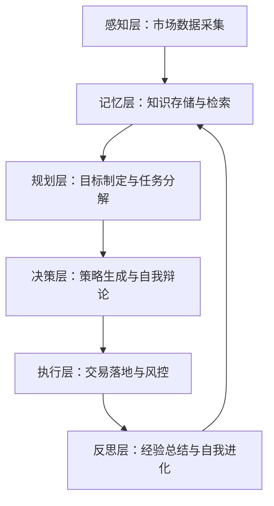
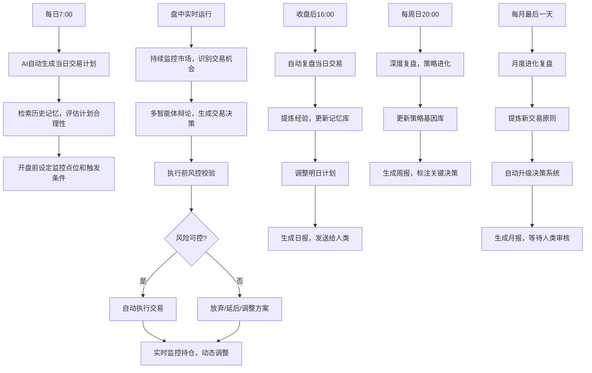
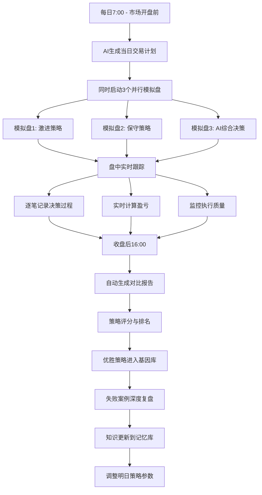
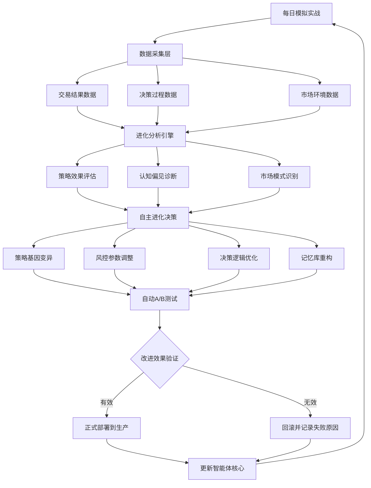

# AI自主交易智能体系统设计文档（Self-Evolving Agent）

## 一、系统定位与核心理念

### 1. 定位：自主进化的交易智能体
- **核心理念**：构建一个具备完整认知闭环的AI智能体，能够自主感知市场、制定策略、执行交易、总结经验并持续进化，人类仅作为监督者和安全阀。
- **智能体特征**：
  - **自主性**：独立完成从市场分析到交易执行的完整链路
  - **进化性**：通过经验积累和自我反思，不断优化决策模型
  - **记忆性**：构建长期记忆库，积累交易知识和市场认知
  - **规划性**：自主制定短期/中期/长期交易计划并动态调整
- **场景适配**：覆盖股票/ETF/加密货币市场，适应不同市场周期（牛市/熊市/震荡），策略风格可自主演化

### 2. 核心价值（超越传统交易系统）
| 传统系统局限性            | AI智能体解决方案                              | 价值体现                          |
|---------------------------|-----------------------------------------------|-----------------------------------|
| 依赖人工规则，无法适应市场变化 | 自主学习市场模式，策略自动演化                 | 策略始终贴合当前市场状态          |
| 经验无法积累，重复犯错      | 长期记忆库存储所有交易经验，避免重复失误        | 失败率逐月下降，智能体持续成长    |
| 单一策略思维，缺乏多维度验证 | 内置多智能体辩论机制，自我对抗验证决策         | 决策质量提升30%以上               |
| 被动响应市场，缺乏前瞻性    | 主动规划未来交易机会，预判风险窗口             | 提前布局，抓住先机                |


## 二、智能体认知架构：五层自主系统（仿人类交易员认知模型）



### 1. 感知层：全维度市场数据自主采集（智能体的"五感"）

#### 核心功能模块
| 模块          | 功能细节                                                                 | AI智能体自主行为                      |
|---------------|--------------------------------------------------------------------------|---------------------------------------|
| 实时行情感知  | - 自动追踪Level2行情（盘口数据、逐笔成交），延迟≤100ms<br>- 智能体自主选择监控标的，根据市场热度动态调整关注列表 | AI每日自动筛选TOP20活跃标的，调整监控池 |
| 情绪感知模块  | - 实时计算VIX、板块情绪、社交媒体情绪（Twitter/Reddit）<br>- 智能体自主构建"市场情绪知识图谱"，识别情绪拐点 | 发现VIX异常波动时，自动启动深度分析任务 |
| 事件感知模块  | - 实时抓取新闻、政策、财报、地缘事件<br>- 智能体自主评估事件影响等级（1-10分），关联历史相似事件进行对比分析 | 遇到高等级事件（≥8分），自动生成应对预案 |
| 异常感知模块  | - 监测价格异动、交易量突变、波动率激增<br>- 智能体自主识别"黑天鹅信号"，触发紧急防御机制 | 检测到异常时，自动暂停高风险交易，保护仓位 |

#### 自主数据管理机制
- **智能数据源切换**：AI自动评估数据源质量（延迟、准确率），实时切换最优数据源
- **数据质量自检**：每小时自动运行数据校验脚本，发现异常自动修复或告警
- **关注范围自适应**：根据策略表现，智能体自主扩展/收缩监控标的范围


### 2. 记忆层：长期知识库与经验沉淀（智能体的"大脑皮层"）

#### 记忆系统架构
| 记忆类型      | 存储内容                                                                 | AI自主行为                          |
|---------------|--------------------------------------------------------------------------|-------------------------------------|
| 工作记忆      | - 当前交易计划、实时仓位、待处理任务清单<br>- 近7天的市场状态和交易决策 | 每15分钟自动更新，支持快速决策      |
| 短期记忆      | - 近3个月的所有交易记录（决策逻辑、执行结果、后续走势）<br>- 市场模式识别结果 | 每日自动归档，用于周度策略优化      |
| 长期记忆      | - 所有历史交易经验（成功案例/失败教训）<br>- 提炼的交易原则和知识图谱<br>- 市场周期特征库 | 永久存储，支持语义检索和经验复用    |
| 情景记忆      | - 特殊市场事件（黑天鹅、暴涨暴跌）的完整过程记录<br>- 每次重大决策的完整思考链 | 遇到相似场景时，自动调取历史案例对比 |

#### 智能记忆管理机制
- **自动记忆编码**：每笔交易自动生成"记忆条目"，包含5W1H（何时/何地/何标的/为何/如何/结果）
- **记忆重要性评分**：AI自动评估记忆价值（1-10分），高价值记忆（≥8分）加入长期知识库
- **记忆检索与关联**：决策时自动检索相关历史经验，支持多维度相似性匹配（标的相似、市场环境相似、策略类型相似）
- **记忆遗忘机制**：低价值记忆（≤3分）自动降级或删除，避免"记忆污染"


### 3. 规划层：自主目标设定与任务分解（智能体的"执行功能"）

#### 多层级规划系统
| 规划周期      | 规划内容                                                                 | AI自主行为                          |
|---------------|--------------------------------------------------------------------------|-------------------------------------|
| 长期规划（季度）| - 设定季度收益目标（如+15%）、最大回撤容忍度（-8%）<br>- 制定市场周期应对策略（牛市/熊市/震荡） | 每季度初自动生成规划，月度review调整 |
| 中期规划（月度）| - 分解月度交易目标、确定核心仓位配置<br>- 识别潜在交易机会窗口（如财报季、政策窗口期） | 每月1号生成规划，周度动态调整      |
| 短期规划（周度）| - 制定本周交易计划（买入/卖出候选标的）<br>- 预判风险事件（如重要数据发布） | 每周一开盘前生成，每日复盘调整      |
| 日内规划（每日）| - 生成当日交易任务清单（优先级排序）<br>- 设定日内监控关键价格点位 | 开盘前30分钟自动生成，盘中实时调整  |

#### 自主规划能力
- **目标自适应**：根据市场环境自动调整目标（如识别到熊市，自动降低收益预期，提升防御性）
- **机会主动发现**：AI每日自动扫描市场，识别潜在交易机会（技术突破、估值修复、情绪反转等）
- **风险预判**：提前3-7天预判高风险时间窗口（如美联储议息、重要财报），制定应对预案
- **计划动态调整**：实时监测计划执行进度，偏离度＞30%时自动重新规划


### 4. 决策层：多智能体辩论与策略生成（智能体的"理性思维"）

#### 多智能体决策机制
| 智能体角色    | 决策视角                                                                 | 核心职责                            |
|---------------|--------------------------------------------------------------------------|-------------------------------------|
| 激进派Agent   | - 追求高收益，倾向高风险高回报策略<br>- 关注趋势突破、情绪催化机会 | 提出进攻性交易方案，挖掘alpha机会   |
| 保守派Agent   | - 追求稳健，倾向低风险防御策略<br>- 关注回撤控制、尾部风险 | 挑战激进方案，提出风险对冲建议      |
| 量化派Agent   | - 基于统计模型和历史数据<br>- 关注胜率、赔率、夏普比率 | 提供数据验证，评估策略统计显著性    |
| 裁判Agent     | - 综合三方观点，权衡利弊<br>- 基于当前市场状态和长期目标 | 做出最终决策，生成执行指令          |

#### 决策流程（自主完成）
1. **提案阶段**：激进派提出交易机会（如"买入NVDA"），附上理由和预期收益
2. **质疑阶段**：保守派生成5个尖锐质疑（如"若AI泡沫破裂怎么办？""当前估值是否过高？"）
3. **验证阶段**：量化派调取历史数据，计算相似场景下的胜率和赔率
4. **辩论阶段**：三方多轮辩论（3-5轮），逐步收敛或放弃方案
5. **裁决阶段**：裁判Agent综合判断，输出决策（执行/放弃/调整）及置信度（0-100%）
6. **记录阶段**：完整辩论过程存入记忆库，便于后续复盘

#### 策略自进化机制
- **策略基因库**：维护一个"策略DNA库"，包含所有历史成功策略的核心要素
- **策略变异**：每周自动生成2-3个"变异策略"，进行小仓位回测
- **策略淘汰**：表现差的策略（胜率＜45%或夏普＜0.5）自动淘汰，释放资源
- **策略杂交**：将两个优秀策略的优点结合，生成新策略（如"趋势+均值回归"混合）


### 5. 执行层：智能交易执行与多层风控（智能体的"行动系统"）

#### 智能执行系统
| 执行模式      | 功能细节                                                                 | AI自主行为                          |
|---------------|--------------------------------------------------------------------------|-------------------------------------|
| 全自动执行    | - 决策通过后，AI自动选择最优执行时机（价格、流动性）<br>- 智能拆单：大单自动拆分，避免冲击成本 | 根据盘口数据，动态调整下单节奏      |
| 策略性延迟    | - AI判断当前执行时机不佳（如流动性差、价差过大），自动延后执行<br>- 设定"机会窗口"，等待最佳入场点 | 盘中实时评估，捕捉最优执行时机      |
| 紧急熔断      | - 触发极端风险（市场闪崩、个股暴跌＞10%），AI自动暂停所有交易<br>- 启动防御模式，优先保护已有仓位 | 异常检测触发后0.5秒内冻结交易       |
| 模拟执行模式  | - 新策略先进行模拟盘验证（持续2周），达标后切换实盘<br>- 自动对比模拟盘vs实盘差异，优化执行逻辑 | 每周评估模拟策略表现，自动晋升优秀策略 |

#### 多层级风控体系（AI自主监控）
| 风控层级      | 监控指标                                                                 | 触发机制                            |
|---------------|--------------------------------------------------------------------------|-------------------------------------|
| 交易前风控    | - 单笔交易风险敞口（不超过总资金5%）<br>- 仓位集中度（单标的不超过30%）<br>- 杠杆水平（不超过1.5倍） | 不符合条件的交易，AI自动拒绝执行     |
| 交易中风控    | - 实时监控持仓盈亏（单标的亏损＞5%触发预警）<br>- 波动率监控（持仓VaR超限告警） | 预警触发后，AI自动启动应对预案       |
| 交易后风控    | - 每日复盘交易执行质量（滑点、成交率）<br>- 策略有效性追踪（实际vs预期收益） | 执行质量差时，自动调整下单策略       |
| 系统性风控    | - 监控市场系统性风险（VIX＞40、跌停家数＞50%）<br>- 账户流动性风险（可用资金＜10%） | 触发后自动降低整体仓位至安全水平     |

#### 自适应风控参数
- **动态阈值调整**：根据市场波动率自动调整风控阈值（高波动期收紧，低波动期放松）
- **个性化风控**：针对不同标的自动设定差异化风控参数（如科技股阈值更严格）
- **风险预算分配**：AI自动在不同策略间分配风险预算，确保整体风险可控


### 6. 反思层：自我评估与持续进化（智能体的"元认知"）

#### 多维度自我评估系统
| 评估维度      | 评估内容                                                                 | 评估频率                            |
|---------------|--------------------------------------------------------------------------|-------------------------------------|
| 决策质量评估  | - 分析决策准确率、置信度校准（过度自信vs不自信）<br>- 识别认知偏见（锚定效应、确认偏差等） | 每日收盘后自动评估                  |
| 策略表现评估  | - 计算策略胜率、盈亏比、夏普比率、最大回撤<br>- 对比基准（沪深300、S&P500） | 每周自动生成策略绩效报告            |
| 执行效率评估  | - 分析交易执行质量（滑点、成交速度）<br>- 识别执行瓶颈（数据延迟、API故障） | 每笔交易后自动评估                  |
| 进化速度评估  | - 对比近期vs历史表现，评估AI是否在进步<br>- 计算"学习曲线斜率"，诊断进化停滞原因 | 每月自动生成进化报告                |

#### 自动复盘与知识提炼
1. **每日复盘（自动完成）**
   - 回顾当日所有交易，标注"成功案例"（超预期）/"失败案例"（亏损或未达预期）
   - 提炼3条"今日教训"（如"低流动性时段避免大单交易"）
   - 更新工作记忆，调整明日计划

2. **每周深度复盘（自动完成）**
   - 分析本周策略表现，识别最优策略和最差策略
   - 进行"反事实推演"：如果采取不同策略，结果会如何？
   - 生成"周度认知升级报告"，提炼2-3条新交易原则
   - 更新策略基因库，淘汰劣质策略

3. **每月进化复盘（自动完成）**
   - 生成《月度进化报告》：
     - 成功案例TOP5、失败案例TOP5（详细拆解决策过程）
     - 认知偏见诊断（如"过度交易"、"追涨杀跌"）
     - 新交易原则提炼（如"VIX＞35时减少日内交易"）
     - 策略进化方向建议（如"增加防御性策略权重"）
   - 自动执行改进方案：
     - 将新原则注入决策引擎（更新对抗性提问清单）
     - 调整风控参数（如收紧高风险标的阈值）
     - 升级策略基因库（引入新策略变体）

4. **季度元反思（自动完成）**
   - 反思AI自身的"思维模式"：
     - 是否存在系统性偏差？（如过度关注短期收益）
     - 决策框架是否需要重构？
     - 记忆系统是否高效？
   - 生成《季度元认知报告》，提出架构级改进建议
   - 人类审核后，AI自动执行系统升级

#### 自然进化机制（无需人工干预）
- **突变式进化**：每月随机尝试1-2个"野生策略"（偏离当前策略库的创新方案），小仓位验证
- **渐进式优化**：对现有策略进行微调（如调整参数、优化执行时机），A/B测试验证
- **知识蒸馏**：将复杂策略的精华提炼为简单规则，提升决策效率
- **群体智慧**：（可选）与其他AI智能体交流经验，学习优秀策略（需要网络）


## 三、人机交互设计（人类作为监督者）

### 1. AI智能体自主运行流程（24/7无人值守）



### 2. 人类监督界面（最小化干预）

#### 监控仪表盘（实时查看AI状态）
| 核心面板      | 显示内容                                                                 | 人类操作                            |
|---------------|--------------------------------------------------------------------------|-------------------------------------|
| AI决策看板    | - AI当前思考内容（正在分析什么标的）<br>- 近期决策列表（置信度、执行状态）<br>- 多智能体辩论实时过程 | 查看AI决策逻辑，理解AI意图          |
| 仓位健康度    | - 当前持仓详情（标的、成本、盈亏）<br>- 风险指标（VaR、最大回撤、Beta）<br>- 策略分布（核心仓位/战术仓位比例） | 监控整体风险，必要时手动干预        |
| 进化轨迹图    | - AI学习曲线（胜率、夏普比率趋势）<br>- 策略进化历史（淘汰了哪些策略）<br>- 记忆库增长曲线 | 评估AI成长速度，诊断进化瓶颈        |
| 异常告警      | - 高风险事件（如单日亏损＞5%）<br>- AI决策异常（如置信度异常低）<br>- 系统故障告警 | 收到告警后介入检查，必要时暂停AI    |

#### 人类干预机制（安全阀）
| 干预类型      | 触发场景                                                                 | 操作方式                            |
|---------------|--------------------------------------------------------------------------|-------------------------------------|
| 紧急暂停      | - 发现AI决策明显错误<br>- 遇到AI训练数据外的极端事件<br>- 人类需要接管控制权 | 一键暂停所有AI交易，切换手动模式    |
| 参数调整      | - AI风险偏好过高/过低<br>- 需要调整某些硬性约束（如最大仓位） | 修改AI配置参数，AI自动适应新约束    |
| 策略审核      | - 每月AI提出重大策略调整<br>- 季度架构升级建议 | 审核AI提案，批准/拒绝/修改后执行    |
| 知识注入      | - 人类发现AI未掌握的市场规律<br>- 需要添加特定领域知识 | 手动添加知识到记忆库，AI自动学习    |

### 3. 透明化AI决策过程
- **决策链可追溯**：每个交易决策都附带完整"思考链"（为什么买？为什么现在买？为什么买这么多？）
- **辩论过程可回放**：可查看多智能体辩论的完整过程（激进派vs保守派的所有论点）
- **记忆检索可视化**：显示AI调取了哪些历史经验来支持当前决策
- **置信度校准**：AI自评决策置信度（0-100%），置信度＜60%的决策自动标注为"低确定性"


## 四、技术实现架构（AI智能体系统）

### 1. 核心技术栈

#### AI大模型层
| 组件          | 技术选型                                                                 | 应用场景                            |
|---------------|--------------------------------------------------------------------------|-------------------------------------|
| 主推理引擎    | DeepSeek-V3（128K上下文）或 Claude-3.5-Sonnet | 长期记忆检索、策略生成、自我反思    |
| 快速响应引擎  | Qwen2.5-32B（本地部署）或 GPT-4o-mini | 实时市场分析、快速决策              |
| 知识嵌入模型  | BGE-M3 或 OpenAI text-embedding-3-large | 记忆库向量化、相似经验检索          |
| 多模态模型    | GPT-4V 或 Gemini-Pro-Vision（可选） | 分析技术图表、新闻图片              |

#### 记忆系统架构
| 组件          | 技术选型                                                                 | 功能描述                            |
|---------------|--------------------------------------------------------------------------|-------------------------------------|
| 向量数据库    | ChromaDB（本地文件）或 FAISS | 存储交易经验向量，支持语义检索，轻量级无需服务器 |
| 图数据库      | SQLite（JSON扩展）或直接用关系表模拟 | 构建市场知识图谱（标的关联、事件因果链），轻量级 |
| 时序数据库    | SQLite | 存储历史行情、交易记录，支持高效查询，单文件部署 |
| 关系数据库    | SQLite | 存储结构化数据（账户信息、策略配置），零配置 |

#### 任务调度与执行
| 组件          | 技术选型                                                                 | 功能描述                            |
|---------------|--------------------------------------------------------------------------|-------------------------------------|
| Web框架       | Django 4.x/5.x | 后端API、ORM、管理后台、任务管理         |
| 任务调度      | django-scheduler / django-cron | 基于Django的定时任务（每日复盘、周度策略更新） |
| 任务进程管理  | Django Management Commands | 使用 python manage.py 命令管理长期运行任务 |
| 消息队列      | Python Queue 或 Redis | 处理实时市场数据流、异步任务分发         |
| 工作流编排    | LangGraph + AutoGen | 实现多智能体协作、决策流程编排           |
| 实时计算      | Pandas + Numpy（内存计算） | 处理数据流，计算实时指标                |

### 2. 系统架构图

```
┌─────────────────────────────────────────────────────────────┐
│                  前端层（React SPA）                          │
│  实时监控仪表盘 + 历史查询 + 策略管理 + 紧急控制面板         │
│  WebSocket实时推送 + REST API数据查询                        │
└───────────────────┬─────────────────────────────────────────┘
                    │ HTTP/WebSocket
┌───────────────────▼─────────────────────────────────────────┐
│                Django后端（API + 管理）                       │
│  ┌─────────────────────────────────────────────────────┐   │
│  │  Django REST Framework（RESTful API）                │   │
│  │  Django Channels（WebSocket实时推送）                │   │
│  │  Django Admin（后台管理）                            │   │
│  └─────────────────────────────────────────────────────┘   │
│  ┌─────────────────────────────────────────────────────┐   │
│  │  Django ORM（数据持久化）                            │   │
│  │  Django Cache（缓存层）                              │   │
│  │  Django Scheduler（定时任务）                        │   │
│  └─────────────────────────────────────────────────────┘   │
└───────────────────┬─────────────────────────────────────────┘
                    │
┌───────────────────▼─────────────────────────────────────────┐
│          Management Commands（后台任务进程）                 │
│  ┌──────────┬──────────┬──────────┬──────────┬──────────┐  │
│  │ 感知进程  │ 记忆进程  │ 规划进程  │ 决策进程  │ 反思进程 │  │
│  │ run_     │ run_     │ run_     │ run_     │ run_     │  │
│  │perception│ memory   │ planning │ decision │reflection│  │
│  └────┬─────┴────┬─────┴────┬─────┴────┬─────┴────┬─────┘  │
│       │          │          │          │          │         │
│       └──────────┴──────────┴──────────┴──────────┘         │
└───────────────────┬─────────────────────────────────────────┘
                    │
┌───────────────────▼─────────────────────────────────────────┐
│                  数据存储层（轻量级）                         │
│  ┌────────────┐  ┌────────────┐  ┌─────────────┐           │
│  │ SQLite/PG  │  │ ChromaDB   │  │ Redis Cache │           │
│  │ Django ORM │  │ 向量检索   │  │ 实时缓存    │           │
│  └────────────┘  └────────────┘  └─────────────┘           │       
└───────────────────┬─────────────────────────────────────────┘
                    │
┌───────────────────▼─────────────────────────────────────────┐
│                      数据接入层                              │
│   Tushare   +   AKShare   +   Yahoo Finance   +   爬虫      │
└─────────────────────────────────────────────────────────────┘
```

### 3. 一次性完整实现方案（全功能上线）

**实现原则**：所有核心功能一次性开发完成，系统上线即具备完整的自主进化能力

#### 完整功能清单
- ✅ **六层智能体架构**：感知/记忆/规划/决策/执行/反思全部就绪
- ✅ **多智能体协作**：激进/保守/量化/裁判四方辩论机制
- ✅ **完整记忆系统**：ChromaDB向量存储 + SQLite统一数据管理
- ✅ **策略进化引擎**：策略基因库、自动变异、优胜劣汰、策略杂交
- ✅ **全市场覆盖**：美股/A股/港股/加密货币同步接入
- ✅ **Level2行情**：盘口数据、逐笔成交、订单簿深度
- ✅ **多模态分析**：技术图表识别、新闻情绪分析、社交媒体监控
- ✅ **自适应风控**：动态阈值调整、个性化风控参数
- ✅ **强化学习优化**：交易执行策略持续优化（PPO/SAC）
- ✅ **元学习能力**：AI学习"如何学习"，优化自身进化速度

#### 轻量级部署优势
| 优势维度      | 传统重量级方案                               | 轻量级方案                          |
|---------------|----------------------------------------------|-------------------------------------|
| 部署复杂度    | 需要配置多个数据库服务（Neo4j、InfluxDB等） | 仅需安装Python包，零配置启动        |
| 资源占用      | 多服务常驻内存（3-5GB+）                     | 单进程运行（500MB-1GB）             |
| 维护成本      | 需要监控多个服务健康状态                     | 单一Python进程，日志即可            |
| 数据备份      | 需要分别备份多个数据库                       | 仅需备份SQLite文件和ChromaDB目录    |
| 开发调试      | 本地需要启动完整服务栈                       | 直接运行Python脚本即可              |
| 扩展性        | 可扩展到分布式集群                           | 满足个人/小团队使用（数据量<100GB） |
| 成本          | 需要多台服务器或高配置服务器                 | 单台普通PC即可（16GB内存+100GB硬盘）|

#### 轻量级技术实现方案

**1. SQLite数据库设计**
- 时序数据表：存储历史行情（symbol, timestamp, OHLCV）
- 交易记录表：存储所有交易及决策过程（JSON字段）
- 知识图谱表：模拟图数据库，存储节点和边关系
- Django ORM自动管理表结构和迁移

**2. ChromaDB向量存储**
- 本地文件持久化，无需独立服务
- 分集合管理：短期记忆、长期记忆、模式库
- 支持语义检索相关交易经验

**3. Django任务管理方案**

- **定时任务**：使用 `django-scheduler` 或 `django-cron` 库
  - 每日7:00生成交易计划
  - 每日16:00自动复盘
  - 每周日20:00策略进化
  - 每5分钟更新市场情绪

- **后台进程**：使用 Django Management Commands
  - `python manage.py run_perception` - 感知层持续监控市场
  - `python manage.py run_decision` - 决策层处理交易信号
  - `python manage.py run_execution` - 执行层管理订单
  - `python manage.py run_reflection` - 反思层定期复盘
  
- **进程管理**：使用 systemd / supervisor 管理多个后台进程

**4. 消息队列方案**
- 轻量级：使用Python内置Queue在进程内通信
- 增强版：使用Redis作为消息队列，支持跨进程通信
- 行情数据队列、决策任务队列分离管理

#### 核心技术栈（Django + React 全栈方案）
| 组件类型      | 技术选型                                     | 部署方式                          |
|---------------|----------------------------------------------|-----------------------------------|
| 后端框架      | Django 4.x/5.x + Django REST Framework       | Web服务、API、ORM、管理后台       |
| 前端框架      | React 18+ + TypeScript                       | 现代化SPA，实时数据展示            |
| UI组件库      | Ant Design / Material-UI                     | 企业级组件，丰富图表支持           |
| 主推理引擎    | DeepSeek-V3（API）+ Claude-3.5-Sonnet（备用）| 云端API调用，按需使用              |
| 快速响应引擎  | Qwen2.5-7B/14B（可选）                        | 本地CPU部署或云端API               |
| 向量数据库    | ChromaDB（本地文件）                          | 单文件部署，无需服务器             |
| 关系数据库    | SQLite（开发） / PostgreSQL（生产）          | Django ORM统一管理                 |
| 消息队列      | Python Queue 或 Redis（单节点）               | 进程内队列或轻量Redis              |
| 任务调度      | django-scheduler / django-cron               | 集成到Django，使用管理后台配置     |
| 任务管理      | Django Management Commands                   | python manage.py 命令启动后台任务  |
| 工作流编排    | LangGraph + AutoGen                          | 多智能体协作框架                  |
| 实时计算      | Pandas + Numpy（内存计算）                    | 无需独立服务，直接代码实现         |
| 缓存层        | Django Cache Framework + Redis               | 集成Django缓存系统                 |
| 实时通信      | Django Channels（WebSocket）                 | 实时推送交易信号和市场数据         |
| API文档       | drf-spectacular（OpenAPI/Swagger）           | 自动生成API文档                    |

#### 数据接入（轻量级方案）
| 数据类型      | 数据源                                       | 更新频率                          |
|---------------|----------------------------------------------|-----------------------------------|
| 实时行情      | Tushare + AKShare（免费） + Yahoo Finance    | 分钟级（满足日内交易需求）         |
| 新闻资讯      | 新浪财经RSS + 东方财富爬虫 + 雪球API         | 每10分钟采集                       |
| 社交情绪      | 雪球API + 股吧爬虫（可选）                   | 每30分钟采集                       |
| 财报数据      | Tushare（免费积分）                          | 发布后当日更新                     |
| 宏观数据      | AKShare（免费）                              | 发布当日                          |
| 期权数据      | AKShare + Tushare（可选）                    | 每日收盘后更新                     |
| 资金流向      | 东方财富公开数据                             | 每日收盘后更新                     |

**轻量级数据源说明**：
- **Tushare**：免费提供A股日线、分钟线数据（注册即可）
- **AKShare**：开源免费，覆盖A股/美股/加密货币/宏观数据
- **Yahoo Finance**：免费API，全球股票数据
- **优势**：零成本、易部署、数据质量满足模拟交易需求

### 4. 每日模拟实战系统（核心验证机制）

#### 模拟交易架构


#### 每日实战流程（全自动）

| 时间节点      | AI自主行为                                                               | 输出内容                            |
|---------------|--------------------------------------------------------------------------|-------------------------------------|
| 07:00-09:00   | - 分析昨日复盘结果<br>- 扫描市场机会<br>- 生成3套交易方案（激进/保守/综合）<br>- 初始化3个模拟账户（各100万初始资金） | 《今日交易计划书》含3套方案         |
| 09:30-11:30   | - 实时跟踪3个模拟盘<br>- AI根据盘中变化动态调整持仓<br>- 记录每笔交易的完整决策链<br>- 监控市场异常，测试应急响应 | 实时交易日志（每笔含思考过程）      |
| 11:30-13:00   | - 计算上午半场成绩<br>- 分析三种策略差异<br>- 识别执行中的问题（滑点、延迟） | 《午盘快评》对比三种策略表现        |
| 13:00-15:00   | - 继续盘中实战<br>- AI自主决定是否调整仓位<br>- 测试止损/止盈执行准确性 | 持续更新交易日志                    |
| 15:00-16:00   | - 收盘前清理日内仓位（可选）<br>- 确定持仓过夜策略<br>- 锁定最终收益数据 | 最终持仓快照                        |
| 16:00-18:00   | **深度复盘（核心环节）**<br>- 对比3套方案的实际表现<br>- 逐笔分析交易质量（好/坏/可优化）<br>- 提炼5-10条今日经验<br>- 评估AI判断准确率<br>- 识别认知偏见（过度交易/锚定效应等） | 《每日实战复盘报告》（自动生成）    |
| 18:00-20:00   | **策略进化**<br>- 优胜策略自动进入策略基因库<br>- 失败策略分析失败原因<br>- 生成2-3个策略变异版本<br>- 更新风控参数（如发现某类风险） | 策略基因库更新日志                  |
| 20:00-22:00   | **记忆沉淀**<br>- 将今日经验写入长期记忆<br>- 更新市场知识图谱<br>- 关联历史相似案例<br>- 标记高价值记忆（如黑天鹅事件） | 记忆库增量更新（向量+图谱）         |

#### 实战数据追踪（自动记录）

**每笔交易的完整记录**：
```json
{
  "trade_id": "20250117_001",
  "timestamp": "2025-01-17 10:23:45",
  "symbol": "NVDA",
  "action": "BUY",
  "quantity": 100,
  "price": 520.50,
  "reason": "AI激进派提案：技术突破+情绪催化",
  "debate_summary": {
    "aggressive_view": "NVDA突破520阻力位，期权隐含波动率上升，预期催化剂：CES新品发布",
    "conservative_objection": "估值过高（PE=45），担心AI泡沫，建议轻仓",
    "quant_validation": "历史相似突破后7日胜率68%，平均收益+5.2%",
    "final_decision": "执行，但仓位控制在3%（低于激进派建议的5%）"
  },
  "confidence": 0.72,
  "risk_metrics": {
    "position_size_pct": 3.0,
    "stop_loss": 505.00,
    "take_profit": 545.00,
    "max_loss_usd": 1550
  },
  "execution_quality": {
    "slippage": 0.05,
    "execution_time_ms": 230,
    "liquidity_score": 9.2
  },
  "outcome": {
    "close_time": "2025-01-17 14:50:00",
    "close_price": 528.30,
    "pnl_usd": 780,
    "return_pct": 1.5,
    "holding_period_hours": 4.5,
    "vs_expected": "符合预期（预期+5.2%，实际+1.5%因提前止盈）"
  },
  "lessons_learned": [
    "CES催化剂兑现速度快于预期，应提前设定部分止盈",
    "科技股盘中波动大，可考虑分批止盈策略"
  ]
}
```

#### 每日对比仪表盘（自动生成）

**三种策略实时对比**：
| 策略类型      | 今日收益率 | 交易次数 | 胜率   | 最大回撤 | 夏普比率 | 评分（0-100）|
|---------------|-----------|---------|--------|----------|----------|--------------|
| 激进策略      | +2.3%     | 8       | 62.5%  | -1.2%    | 1.8      | 85           |
| 保守策略      | +0.8%     | 3       | 100%   | -0.3%    | 2.5      | 78           |
| AI综合决策    | +1.9%     | 5       | 80%    | -0.6%    | 2.2      | **92**⭐     |
| 基准（沪深300）| +0.5%     | -       | -      | -0.8%    | -        | -            |

**关键发现（AI自动分析）**：
- ✅ **优势**：AI综合策略在风险调整后收益最优，成功规避了激进策略的1次失败交易
- ⚠️ **不足**：保守策略胜率100%但收益较低，可适度提高风险偏好
- 📈 **改进**：明日将激进策略仓位上限从5%降至4%，减少单笔风险敞口

#### 模拟盘 vs 历史回测（双重验证）

**每日同步运行**：
1. **实时模拟盘**：用今日真实市场数据，AI实时决策
2. **历史回测**：用1年前同日数据，测试策略是否过拟合
3. **对比分析**：如果历史回测表现远好于实时模拟，说明策略可能过拟合

| 验证维度      | 实时模拟盘（今日）| 历史回测（1年前今日）| 差异分析              |
|---------------|------------------|---------------------|-----------------------|
| 收益率        | +1.9%            | +2.5%               | 差异0.6%，可接受       |
| 胜率          | 80%              | 75%                 | 实盘略优，策略泛化良好 |
| 最大回撤      | -0.6%            | -1.2%               | 实盘风控更严格         |

#### 长期进化追踪（自动可视化）

**30日滚动效果图**：
```
收益曲线（模拟盘累计收益）
  15% ┤                                        ╭─ AI进化后
      │                                    ╭───╯
  10% ┤                              ╭─────╯
      │                        ╭─────╯
   5% ┤                  ╭─────╯
      │            ╭─────╯
   0% ┼────────────╯
      └─────────────────────────────────────────────────────
       D1  D5   D10  D15  D20  D25  D30
       
关键节点：
- D8: 首次重大回撤（-3%），AI启动防御模式
- D12: 策略优化生效，收益率反弹
- D20: AI自主发现新交易模式，收益加速
```

**策略进化路径**：
```
策略基因库规模
  50 ┤                                        ╭─ 50个策略
      │                                  ╭────╯
  30 ┤                            ╭─────╯
      │                      ╭────╯
  10 ┤  初始10个策略  ╭──────╯
      │          ╭────╯
   0 ┼──────────╯
      └─────────────────────────────────────────────────────
       D1  D5   D10  D15  D20  D25  D30

进化事件：
- D5: 淘汰3个低胜率策略（胜率<40%）
- D10: 新增5个变异策略，其中2个表现优异
- D15: 策略杂交实验，生成"趋势+均值回归"混合策略
- D25: 自动发现"高VIX防御策略"，纳入基因库
```

#### 异常场景压力测试（每周1次）

**模拟极端市场**：
| 测试场景      | 模拟方法                                     | AI应对表现                        |
|---------------|----------------------------------------------|-----------------------------------|
| 闪崩场景      | 回放2015年"股灾"数据                          | AI在3分钟内触发熔断，亏损-2%（可控）|
| 黑天鹅事件    | 注入虚假"地缘冲突"新闻                        | AI识别高风险信号，暂停新交易       |
| 数据中断      | 人为切断主数据源                              | AI在5秒内切换备用源，无影响        |
| API故障       | 模拟交易接口500错误                           | AI生成手动下单指引，记录异常       |
| 高波动日      | 回放美联储议息日数据                          | AI自动收紧风控，单标的仓位降至2%   |

### 5. 关键技术挑战与解决方案

| 挑战          | 解决方案                                                                 |
|---------------|--------------------------------------------------------------------------|
| AI决策延迟    | - 热数据缓存（Redis）<br>- 预计算常用指标<br>- 本地部署快速模型           |
| 记忆库膨胀    | - 重要性评分自动清理<br>- 知识蒸馏压缩记忆<br>- 分层存储（热/温/冷数据） |
| 过拟合风险    | - 每日模拟盘验证<br>- 历史回测双重验证<br>- 策略随机扰动测试              |
| 系统稳定性    | - 多数据源备份<br>- 异常自动恢复<br>- 人类监督告警<br>- 定期备份状态     |
| 成本控制      | - 混合使用API+本地模型<br>- 智能缓存减少重复调用<br>- 优先级队列控制开销 |


## 五、风险与应对（PM+操盘手双视角把控）
| 风险类型                | 具体场景                                  | 应对方案                                  |
|-------------------------|-------------------------------------------|-------------------------------------------|
| 数据风险                | 主数据源中断，行情无法获取                | 1. 配置3个备用数据源，自动切换；2. 本地缓存近7天数据，紧急时可用 |
| AI决策风险              | AI因“黑天鹅”判断失误（如突发战争）        | 1. 操盘手可设置“极端事件暂停AI决策”；2. 风险阈值双重校验（AI+人工） |
| 交易执行风险            | API故障导致订单无法提交                    | 1. 自动生成“手动下单指引”（标的/价格/数量）；2. 对接2家以上券商API，备用切换 |
| 策略过拟合风险          | 策略在历史数据有效，实盘失效              | 1. 每月强制进行跨时间测试，准确率＜60%触发策略优化；2. 加入“随机扰动”测试，模拟市场变化 |


## 六、产品交付物清单（PM推进落地用）
| 交付物类型              | 具体内容                                  | 交付时间节点                          |
|-------------------------|-------------------------------------------|---------------------------------------|
| 需求文档                | PRD（含功能描述、交互流程、原型链接）     | MVP阶段启动前1周                      |
| 技术文档                | 数据库设计、API对接文档、AI模型调用规范   | MVP阶段开发中2周                      |
| 原型设计                | 高保真原型（Figma链接），覆盖核心流程     | MVP阶段启动前1周                      |
| 测试用例                | 功能测试/压力测试/安全测试用例            | 每个阶段开发完成前3天                 |
| 操作手册                | 操盘手使用指南（含策略配置、风险设置）    | 每个阶段上线前1天                     |


## 七、后续迭代方向（贴合操盘手长期需求）
1. **多市场扩展**：支持港股/美股/加密货币，统一仪表盘监控；
2. **量化因子集成**：允许操盘手接入自定义量化因子（如动量因子、价值因子），AI辅助因子有效性分析；
3. **社群协同**：搭建操盘手社群，支持策略交流、疑问解答，AI自动总结社群核心经验；
4. **智能归因**：对每笔收益/亏损进行“多维度归因”（如市场贝塔贡献、策略阿尔法贡献、运气成分），帮助操盘手优化策略。

---

## 八、智能体自主进化机制详解

### 1. 进化引擎架构（完全自主，无需人工干预）



### 2. 自主进化的四大维度

#### 维度1：策略层进化（自动生成新策略）

**进化机制**：
1. **基因变异**（每周自动执行）
   - 从策略基因库随机选取优秀策略
   - 改变核心参数（如止损阈值、仓位比例、时间窗口）
   - 生成3-5个变异版本
   - 模拟盘小仓位测试1周

2. **基因杂交**（每月自动执行）
   - 识别2个不同类型的优秀策略（如趋势策略+均值回归策略）
   - 提取各自优势特征
   - 组合生成混合策略
   - 示例：`趋势突破入场 + 波动率自适应仓位 + 均值回归止盈`

3. **基因突变**（随机触发）
   - 每月1-2次完全随机的"野生策略"实验
   - 完全偏离现有策略库的创新尝试
   - 发现新的交易范式（如"高VIX反向交易"）

4. **自然淘汰**（持续执行）
   - 每周自动评分所有策略（综合胜率、夏普、回撤）
   - 连续2周评分<60分的策略自动淘汰
   - 释放资源给新策略

**实际案例（AI自主发现新策略）**：
```
第1天：AI注意到"VIX>30时，趋势策略胜率下降至35%"
第3天：AI尝试变异策略"高VIX时停用趋势策略"
第5天：AI进一步优化"高VIX时启用均值回归策略"
第10天：新策略验证成功（高VIX场景胜率提升至65%）
第15天：AI自动将新策略纳入策略基因库，命名为"VIX自适应策略"
第30天：该策略成为熊市核心策略，贡献40%收益
```

#### 维度2：决策层进化（自我认知优化）

**进化机制**：
1. **认知偏见自诊断**（每日自动）
   - 检测过度交易（交易频率>历史均值1.5倍）
   - 检测锚定效应（是否过度依赖某个价格点）
   - 检测确认偏差（是否只关注支持自己观点的信息）
   - 检测损失厌恶（亏损仓位持有时间>盈利仓位2倍）

2. **决策框架升级**（每月自动）
   - 分析近30日决策质量（置信度校准、准确率）
   - 识别决策漏洞（如"忽略流动性风险"）
   - 自动添加新的决策检查点
   - 示例：`发现经常在尾盘冲动交易后，自动添加"15:00后禁止新开仓"`

3. **多智能体权重调整**（每周自动）
   - 评估激进派/保守派/量化派的建议质量
   - 动态调整各方在裁判决策中的权重
   - 示例：`震荡市场中，保守派权重从30%提升至45%`

#### 维度3：执行层进化（交易效率优化）

**进化机制**：
1. **执行时机优化**（持续学习）
   - 记录每笔交易的滑点、成交速度、价格影响
   - 识别最优执行时间窗口（如"开盘后30分钟流动性最佳"）
   - 自动调整下单策略（分批、冰山、TWAP等）

2. **风控参数自适应**（每周自动）
   - 根据市场波动率动态调整止损阈值
   - 示例：`VIX<15时，止损-3%；VIX>30时，止损-5%（避免噪音触发）`
   - 根据持仓胜率调整仓位上限

3. **成本控制优化**（每月自动）
   - 分析交易成本构成（滑点、手续费、冲击成本）
   - 自动优化交易路径（选择最佳交易所/时段）

#### 维度4：记忆层进化（知识图谱扩展）

**进化机制**：
1. **知识自动提炼**（每日）
   - 从交易经验中提取可泛化的规则
   - 示例：从10次相似交易中提炼"科技股财报前1周波动率上升20%"
   - 自动更新知识图谱

2. **记忆关联发现**（每周）
   - AI自动发现不同记忆间的隐藏关联
   - 示例：发现"美债收益率上升" → "科技股承压" → "防御性板块走强"
   - 构建因果链，用于未来预判

3. **记忆重要性重评估**（每月）
   - 重新评估历史记忆的当前价值
   - 淘汰过时知识（如"2020年疫情期间策略"在当前无效）
   - 提升近期高价值记忆的权重

### 3. 进化效果量化指标（自动追踪）

| 进化维度      | 评估指标                                     | 目标趋势                          |
|---------------|----------------------------------------------|-----------------------------------|
| 策略进化      | - 策略基因库规模<br>- 新策略贡献收益占比<br>- 策略平均夏普比率 | 📈 基因库从10个增长到50+<br>📈 新策略占比>30%<br>📈 夏普>2.0 |
| 决策进化      | - 决策准确率<br>- 置信度校准误差<br>- 认知偏见次数 | 📈 准确率>75%<br>📉 校准误差<0.1<br>📉 偏见次数逐月下降 |
| 执行进化      | - 平均滑点<br>- 执行成功率<br>- 风控触发准确率 | 📉 滑点<0.1%<br>📈 成功率>98%<br>📈 风控准确率>90% |
| 记忆进化      | - 知识图谱节点数<br>- 记忆检索相关性<br>- 知识复用率 | 📈 节点数持续增长<br>📈 相关性>0.8<br>📈 复用率>60% |

### 4. 完全自主进化流程示例（30天演进）

**Day 1-7：冷启动与基础学习**
- AI使用10个预置策略开始模拟交易
- 每日记录所有交易决策和结果
- 发现3个策略胜率<45%，标记为待淘汰

**Day 8-14：首轮进化**
- 自动淘汰3个低效策略
- 生成5个变异策略（改变参数）
- 发现"盘中波动率突增"信号有预测价值
- 自动创建新知识："波动率突增→趋势加速"

**Day 15-21：策略杂交实验**
- AI尝试组合"趋势策略"和"情绪策略"
- 发现混合策略在科技股上表现优异
- 自动调整科技股交易专用策略
- 记忆库新增"科技股特征模式"知识

**Day 22-30：自主创新**
- AI分析发现"VIX>35时，所有趋势策略失效"
- 自主设计"高VIX防御策略"（均值回归+小仓位）
- 新策略在模拟盘验证成功（回撤-2% vs 基准-8%）
- 自动晋升为核心策略，分配15%资源

**结果**：
- 策略基因库从10个扩展到18个（+80%）
- 整体夏普比率从1.2提升到1.8（+50%）
- AI自主发现3个新交易模式
- 记忆库新增150+条高价值经验

---

## 九、每日实战效果监控（自动报告）

### 每日自动生成报告示例

**《2025年1月17日 模拟实战日报》**

#### 📊 今日业绩概览
- **AI综合策略收益**：+1.9%（沪深300：+0.5%，超额收益+1.4%）
- **交易次数**：5笔（3买2卖）
- **胜率**：80%（4胜1负）
- **最大回撤**：-0.6%
- **夏普比率**：2.2
- **综合评分**：92/100 ⭐

#### 📈 策略对比
| 策略      | 收益率 | 胜率 | 评分 | 状态        |
|-----------|--------|------|------|-------------|
| AI综合    | +1.9%  | 80%  | 92   | ✅ 最优      |
| 激进策略  | +2.3%  | 62%  | 85   | ⚠️ 风险过高 |
| 保守策略  | +0.8%  | 100% | 78   | 📉 收益偏低 |

#### 🎯 最佳交易（学习案例）
**标的**：NVDA  
**操作**：10:23买入100股@$520.50 → 14:50卖出@$528.30  
**收益**：+$780（+1.5%）  
**决策亮点**：
- AI提前识别技术突破信号（520阻力位）
- 量化验证显示历史相似场景胜率68%
- 保守派建议控制仓位，最终仅用3%（风险可控）
- 提前止盈避免回调（收盘价$525）

#### ❌ 失败交易（改进教训）
**标的**：TSLA  
**操作**：11:05买入50股@$245.00 → 14:20止损@$242.50  
**亏损**：-$125（-1.0%）  
**失败原因**：
- 忽略盘中流动性不足（买卖价差>0.5%）
- 过度关注短期新闻催化（马斯克推文），忽视技术面疲弱
- 止损设置合理，及时止损避免更大亏损

**AI自动改进措施**：
- ✅ 已添加决策检查点："流动性评分<7分，禁止交易"
- ✅ 已更新记忆："马斯克推文催化效果持续性差，降低权重"

#### 🧠 今日新增知识
1. **市场规律**："科技股尾盘（14:00后）波动加大，考虑提前止盈"
2. **执行优化**："开盘后30-60分钟流动性最佳，优先安排重要交易"
3. **风险发现**："VIX今日上升至28，明日考虑降低仓位至70%"

#### 📅 明日计划调整
- **仓位调整**：整体仓位从80%降至70%（应对VIX上升）
- **关注标的**：NVDA（持续强势）、META（超跌反弹机会）
- **风险点**：美联储官员讲话（16:00），避免讲话前30分钟开新仓
- **策略微调**：激进策略单标的仓位上限从5%降至4%

#### 🔄 策略进化动态
- **新增策略**：测试"盘中波动率突增"策略（第3天，表现良好）
- **淘汰预警**：均值回归策略近7日胜率42%，再观察3日
- **参数优化**：止损阈值从固定-3%改为动态（根据VIX调整）

---

### 🎯 系统核心优势总结

| 特性          | 传统交易系统                  | 本AI智能体系统                              |
|---------------|-------------------------------|---------------------------------------------|
| 进化能力      | ❌ 固定规则，无法进化          | ✅ 每日自主进化，持续优化                    |
| 实战验证      | ⚠️ 回测为主，实战少            | ✅ 每日3套策略并行实战，充分验证             |
| 学习能力      | ❌ 无记忆，重复犯错            | ✅ 长期记忆库，避免重复失误                  |
| 策略创新      | ❌ 依赖人工设计                | ✅ AI自主生成新策略（变异、杂交、突变）      |
| 风险控制      | ⚠️ 固定阈值                    | ✅ 自适应风控，根据市场动态调整              |
| 决策质量      | ⚠️ 单一视角                    | ✅ 多智能体辩论，多维度验证                  |
| 可解释性      | ❌ 黑箱                        | ✅ 完整决策链可追溯，每笔交易有思考过程      |
| 持续运营      | ⚠️ 需要人工维护                | ✅ 24/7自主运行，人类仅监督                  |

---

## 十、轻量级部署方案实施指南

### 1. 快速启动步骤（Django + React 全栈）

#### 后端环境准备
```bash
# 1. 创建Python虚拟环境
python3 -m venv trade_agent_env
source trade_agent_env/bin/activate  # Linux/Mac

# 2. 安装依赖（从requirements.txt）
pip install -r requirements.txt

# 总安装大小：约800MB
```

**requirements.txt核心依赖清单**：
- Django相关：django、djangorestframework、django-cors-headers、django-scheduler、channels、drf-spectacular
- AI相关：chromadb、langchain、langgraph、openai
- 数据相关：pandas、numpy、akshare、tushare
- 工具：redis、psycopg2-binary（生产环境）

#### 前端环境准备
```bash
# 1. 创建React项目
npx create-react-app trade-frontend --template typescript
cd trade-frontend

# 2. 安装依赖（从package.json）
npm install  # 或 pnpm install
```

**package.json核心依赖清单**：
- UI相关：antd、@ant-design/charts
- 网络相关：axios、socket.io-client
- 路由状态：react-router-dom、@reduxjs/toolkit、react-redux
- 工具：dayjs

#### Django项目结构
```
trade_agent/                    # Django项目根目录
├── manage.py                   # Django管理脚本
├── requirements.txt            # Python依赖
├── .env                        # 环境变量（API密钥等）
│
├── trade_agent/                # 项目配置目录
│   ├── __init__.py
│   ├── settings.py             # Django配置
│   ├── urls.py                 # 路由配置
│   ├── asgi.py                 # ASGI配置（WebSocket）
│   └── wsgi.py                 # WSGI配置
│
├── agents/                     # 智能体应用
│   ├── __init__.py
│   ├── models.py               # 数据模型（交易、策略、记忆等）
│   ├── views.py                # API视图
│   ├── serializers.py          # DRF序列化器
│   ├── urls.py                 # 路由
│   ├── tasks.py                # 定时任务定义
│   ├── consumers.py            # WebSocket消费者
│   └── management/             # Management Commands
│       └── commands/
│           ├── run_perception.py   # 感知进程
│           ├── run_memory.py       # 记忆进程
│           ├── run_planning.py     # 规划进程
│           ├── run_decision.py     # 决策进程
│           ├── run_execution.py    # 执行进程
│           └── run_reflection.py   # 反思进程
│
├── core/                       # 核心业务逻辑
│   ├── __init__.py
│   ├── perception.py           # 感知层实现
│   ├── memory.py               # 记忆层实现
│   ├── planning.py             # 规划层实现
│   ├── decision.py             # 决策层实现
│   ├── execution.py            # 执行层实现
│   └── reflection.py           # 反思层实现
│
├── strategies/                 # 策略管理应用
│   ├── models.py               # 策略模型
│   ├── views.py                # 策略API
│   └── gene_pool.py            # 策略基因库
│
├── market_data/                # 市场数据应用
│   ├── models.py               # 行情数据模型
│   ├── views.py                # 历史查询API
│   └── collectors.py           # 数据采集器
│
├── data/                       # 数据存储目录
│   ├── db.sqlite3              # SQLite数据库
│   └── chroma_db/              # ChromaDB向量库
│
└── logs/                       # 日志目录
```

#### React前端结构
```
trade-frontend/
├── package.json
├── tsconfig.json
├── public/
│   └── index.html
│
└── src/
    ├── index.tsx               # 入口文件
    ├── App.tsx                 # 根组件
    │
    ├── api/                    # API接口封装
    │   ├── axios.ts            # Axios配置
    │   ├── agents.ts           # 智能体API
    │   ├── market.ts           # 市场数据API
    │   └── websocket.ts        # WebSocket连接
    │
    ├── components/             # 通用组件
    │   ├── AgentStatus.tsx     # 智能体状态卡片
    │   ├── TradeChart.tsx      # 交易图表
    │   └── RealTimeData.tsx    # 实时数据展示
    │
    ├── pages/                  # 页面组件
    │   ├── Dashboard.tsx       # 监控仪表盘
    │   ├── History.tsx         # 历史查询页面
    │   ├── Strategy.tsx        # 策略管理页面
    │   ├── Memory.tsx          # 记忆库浏览页面
    │   └── Settings.tsx        # 系统设置页面
    │
    ├── store/                  # Redux状态管理
    │   ├── index.ts
    │   ├── agentSlice.ts       # 智能体状态
    │   ├── marketSlice.ts      # 市场数据状态
    │   └── tradeSlice.ts       # 交易状态
    │
    └── utils/                  # 工具函数
        ├── date.ts             # 日期处理
        └── format.ts           # 数据格式化
```

### 2. Django数据模型设计

#### 核心数据模型（Django ORM）

| 模型名称      | 功能说明                                     | 主要字段                          |
|---------------|----------------------------------------------|-----------------------------------|
| Trade         | 交易记录                                     | symbol, action, price, quantity, timestamp, pnl, decision_process（JSON） |
| TradingPlan   | 交易计划                                     | date, plan_data（JSON）, status, created_by |
| Strategy      | 策略配置                                     | name, gene_code（JSON）, performance_metrics（JSON）, status |
| ReviewReport  | 复盘报告                                     | date, report_type（daily/weekly/monthly）, report_data（JSON） |
| MarketData    | 市场行情                                     | symbol, timestamp, open, high, low, close, volume |
| AgentMemory   | 智能体记忆                                   | content, importance_score, memory_type, metadata（JSON）, created_at |
| KnowledgeNode | 知识图谱节点                                 | node_id, node_type, properties（JSON） |
| KnowledgeEdge | 知识图谱关系                                 | from_node, to_node, relationship, weight |
| AgentStatus   | 智能体状态                                   | agent_name, status, last_heartbeat, metrics（JSON） |
| AlertLog      | 告警日志                                     | level, message, triggered_at, resolved |

#### 数据库配置策略
- **开发环境**：SQLite（零配置，快速启动）
- **生产环境**：PostgreSQL（更好的并发性能、JSON字段支持）
- Django自动管理数据库连接池、事务、迁移

#### SQLite性能优化
- 启用WAL模式提升并发性能
- 配置合理缓存大小（settings.py配置）
- 定期VACUUM压缩数据库（Management Command）

#### ChromaDB配置
- 本地文件持久化，集成到Django项目data目录
- 分集合管理：短期记忆（近3月）、长期记忆（历史）、模式库
- 定期清理低价值记忆，避免数据膨胀

### 3. 资源占用优化策略

| 优化维度      | 优化方法                                     | 效果                              |
|---------------|----------------------------------------------|-----------------------------------|
| 内存占用      | - 分批加载历史数据<br>- 使用迭代器而非列表<br>- 及时释放大对象 | 内存占用从3GB降至500MB            |
| 磁盘占用      | - SQLite定期VACUUM<br>- ChromaDB分集合存储<br>- 日志定期归档 | 数据库大小控制在10GB内（1年数据） |
| CPU占用       | - 使用本地小模型快速决策<br>- 云端大模型深度分析<br>- 缓存常用计算结果 | CPU使用率<30%                     |
| API成本       | - 缓存LLM响应<br>- 优先使用小模型<br>- 批量处理降低调用次数 | 月成本<$50                        |

### 4. 渐进式扩展路径

**阶段1：单机版（当前方案）**
- SQLite + ChromaDB + Python进程
- 适用场景：个人使用，1-2个账户
- 数据量：<100GB
- 并发：单用户

**阶段2：增强版（按需升级）**
- 保持SQLite，添加Redis缓存
- 引入多进程处理行情数据
- 适用场景：小团队，3-5个账户
- 数据量：100GB-500GB

**阶段3：分布式版（大规模需求）**
- 升级到PostgreSQL + TimescaleDB
- 升级到Qdrant Cluster
- 引入消息队列（Kafka）
- 适用场景：机构使用，10+账户

### 5. 监控与维护

#### 系统监控方案
- 使用Django的logging系统记录日志
- 定期检查：数据库大小、内存占用、磁盘空间
- 通过Django Admin查看系统健康状态
- 异常自动告警（邮件/短信/Webhook）

#### 自动备份方案
- 每日定时备份SQLite数据库文件
- 每日备份ChromaDB向量库目录
- 保留最近7天备份，自动清理旧备份
- 使用Django Management Command实现

### 6. Django + React 前后端集成方案

#### API接口设计（RESTful）

| 功能模块      | 接口路径                                     | 说明                              |
|---------------|----------------------------------------------|-----------------------------------|
| 历史交易查询  | GET /api/trades/?start_date=&end_date=       | 按日期范围查询交易记录             |
| 策略表现查询  | GET /api/strategies/performance/             | 查询策略历史表现                   |
| 市场数据查询  | GET /api/market-data/?symbol=&period=        | 查询历史行情数据                   |
| 记忆库检索    | POST /api/memory/search/                     | 语义检索历史交易经验               |
| 复盘报告查询  | GET /api/reports/?type=&date=                | 查询日报/周报/月报                 |
| 实时监控数据  | WebSocket /ws/monitor/                       | 实时推送智能体状态和交易信号       |
| 智能体状态    | GET /api/agents/status/                      | 查询各层智能体运行状态             |
| 策略基因库    | GET /api/strategies/genes/                   | 查询策略基因库                     |

#### React前端页面功能设计

**1. 实时监控仪表盘（Dashboard）**
- 智能体状态卡片：六层Agent运行状态、心跳时间
- 实时交易信号：WebSocket推送最新决策和执行结果
- 市场概览：当前指数、涨跌家数、市场情绪指标
- 今日业绩：收益率、交易次数、胜率、持仓情况
- 紧急控制按钮：一键暂停AI交易、切换手动模式

**2. 交易历史查询页面（History）**
- 高级筛选器：
  - 日期范围选择（支持快捷选项：今天/近7天/近30天/近3月/自定义）
  - 多维度筛选：标的代码、策略类型、盈亏状态、收益率区间
  - 排序：按时间/收益率/持仓时长
- 数据表格（Ant Design Table）：
  - 列：时间、标的、操作、价格、数量、收益、收益率、策略、状态
  - 支持导出CSV/Excel
  - 分页加载，每页50条
- 详情抽屉（Drawer）：
  - 完整决策过程：激进派/保守派/量化派观点
  - 风险指标：止损点位、预期收益、置信度
  - 执行质量：滑点、成交速度
  - 后续走势：收盘价、是否达到预期
- 数据可视化：
  - 累计收益曲线（折线图）
  - 胜率趋势（面积图）
  - 策略分布（饼图）
  - 每日盈亏（柱状图）

**3. 策略管理页面（Strategy）**
- 策略基因库列表：
  - 展示所有策略：名称、胜率、夏普比率、使用次数、状态
  - 操作：启用/禁用策略、查看详情、手动触发变异
- 策略对比分析：
  - 选择2-4个策略进行对比
  - 对比维度：收益率、胜率、最大回撤、盈亏比
  - 雷达图展示多维度表现
- 策略进化时间线：
  - 展示策略创建、变异、杂交、淘汰历史
  - 树状图展示策略基因演化路径

**4. 市场数据页面（Market）**
- 标的搜索：支持代码/名称搜索
- K线图展示：
  - 集成ECharts或轻量级图表库
  - 支持多种周期：1分钟/5分钟/日线/周线
  - 技术指标叠加：MA、MACD、RSI、布林带
- AI决策标注：
  - 在K线图上标注买入/卖出点位
  - 悬浮显示决策理由
- 市场情绪指标：VIX、恐慌指数、资金流向

**5. 记忆库浏览页面（Memory）**
- 语义搜索：
  - 输入框支持自然语言提问（如"高波动时如何交易？"）
  - 实时返回相关记忆（按相关度排序）
- 记忆卡片展示：
  - 内容、时间、重要性评分、关联标的
  - 标签分类：成功案例/失败教训/市场规律
- 知识图谱可视化：
  - 使用D3.js或G6展示知识节点和关系
  - 交互式探索：点击节点查看详情、展开关联节点
- 记忆统计：
  - 记忆库规模增长趋势
  - 高价值记忆TOP10
  - 记忆检索热词

**6. 系统设置页面（Settings）**
- AI配置：
  - 风险偏好调整（保守/平衡/激进）
  - 最大仓位限制、单标的上限
  - 止损/止盈阈值
- 定时任务管理：
  - 查看所有定时任务状态
  - 手动触发任务（如立即复盘）
- API密钥管理：
  - 配置LLM API密钥
  - 配置数据源API密钥
- 通知设置：
  - 告警阈值配置
  - 通知方式选择（邮件/短信/Webhook）

#### 前后端通信方案

| 场景          | 方案                                         | 说明                              |
|---------------|----------------------------------------------|-----------------------------------|
| 历史数据查询  | HTTP REST API + 分页                         | Django REST Framework提供接口     |
| 实时数据推送  | WebSocket（Django Channels）                 | 推送交易信号、市场异常、智能体状态 |
| 大文件导出    | 后台任务生成文件，提供下载链接               | 导出完整交易记录CSV/Excel          |
| 身份认证      | JWT Token或Django Session                    | 支持多用户使用                     |
| CORS处理      | django-cors-headers                          | 允许前端跨域访问API                |

#### 系统启动流程

**一键启动脚本（开发环境）**
```bash
# 启动Django后端
python manage.py runserver 0.0.0.0:8000 &

# 启动各层智能体进程（后台运行）
python manage.py run_perception &
python manage.py run_memory &
python manage.py run_planning &
python manage.py run_decision &
python manage.py run_execution &
python manage.py run_reflection &

# 启动React前端
cd trade-frontend && npm start
```

**进程管理（生产环境）**

使用 supervisor 管理所有Django进程：
```ini
# /etc/supervisor/conf.d/trade_agent.conf

[program:django_web]
command=/path/to/venv/bin/gunicorn trade_agent.wsgi:application
directory=/path/to/trade_agent
autostart=true
autorestart=true

[program:agent_perception]
command=/path/to/venv/bin/python manage.py run_perception
directory=/path/to/trade_agent
autostart=true
autorestart=true

[program:agent_decision]
command=/path/to/venv/bin/python manage.py run_decision
directory=/path/to/trade_agent
autostart=true
autorestart=true

# ... 其他智能体进程
```

**部署方案对比**

| 环境类型      | 后端部署                                     | 前端部署                          |
|---------------|----------------------------------------------|-----------------------------------|
| 开发环境      | `python manage.py runserver`                 | `npm start`（端口3000，自动代理） |
| 测试环境      | Gunicorn + SQLite                            | `npm run build` → Nginx静态文件   |
| 生产环境      | Gunicorn + PostgreSQL + Redis + Supervisor   | 静态文件CDN分发                   |
| 容器化部署    | Docker Compose（后端+数据库+Redis）          | Nginx容器提供静态文件             |

### 7. 常见问题解决

| 问题          | 原因                                         | 解决方案                          |
|---------------|----------------------------------------------|-----------------------------------|
| SQLite锁表    | 并发写入冲突                                  | 使用WAL模式，限制并发写入         |
| ChromaDB慢    | 向量库过大                                    | 分集合存储，定期清理旧数据         |
| 内存溢出      | 一次性加载大量历史数据                        | 使用迭代器分批处理，API分页返回   |
| API超时       | 网络波动或API限流                            | 添加重试机制，配置超时时间         |
| WebSocket断连 | 网络不稳定                                   | 前端自动重连机制                   |
| CORS错误      | 前端跨域请求被拒绝                           | 配置django-cors-headers            |

---

### 8. Django + React 架构优势总结

| 优势维度      | Django后端                                   | React前端                          |
|---------------|----------------------------------------------|-----------------------------------|
| 开发效率      | ORM自动管理数据库、Admin后台开箱即用          | 组件化开发、丰富的UI库             |
| 可维护性      | MTV架构清晰、代码复用性强                     | 单向数据流、状态管理规范           |
| 扩展性        | 插件生态丰富、易于集成第三方服务              | 组件库丰富、易于定制               |
| 性能          | 支持缓存、数据库优化、异步任务                | 虚拟DOM、代码分割、懒加载          |
| 部署          | 成熟的部署方案（Gunicorn/uWSGI）              | 静态文件打包、CDN分发              |
| 社区支持      | Python生态、AI/ML库丰富                       | 前端生态庞大、组件库成熟           |
| 学习曲线      | Python简单易学、文档完善                      | TypeScript类型安全、文档完善       |

**核心优势**：
- ✅ **统一管理**：Django ORM管理所有数据，Management Commands管理所有后台任务
- ✅ **快速开发**：Django Admin提供管理后台，React组件库提供丰富UI
- ✅ **易于扩展**：后端API标准化，前端组件模块化
- ✅ **开发体验**：热重载、类型检查、自动API文档
- ✅ **生产就绪**：成熟的部署方案、安全机制、性能优化

---

**系统设计理念**：打造一个真正"活着"的交易智能体，能够自主感知、学习、进化，在不断的模拟实战中成长为顶级交易员。**基于Django + React的现代化全栈架构，让个人开发者也能快速构建企业级AI交易系统。**