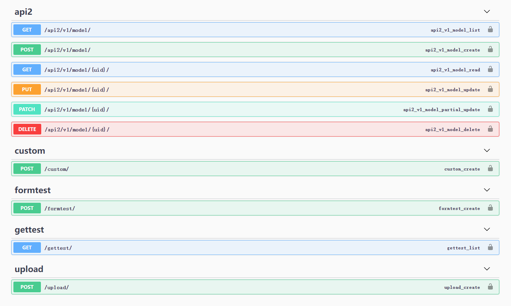

# 依赖

```bash
pip install rest_framework
pip install drf_yasg2
```

# 配置权限

```python
from utils.djSwagger import permission_auth


class MyUserAuthentication(permission_auth.UserAuthentication):
    pass


class MyPermission(permission_auth.UserPermission):
    pass

```

# install app

```python
INSTALLED_APPS = [
    ...,
    "rest_framework",
    "drf_yasg2",
    ...

]
REST_FRAMEWORK = {
    'DEFAULT_SCHEMA_CLASS': 'rest_framework.schemas.coreapi.AutoSchema',
    'DEFAULT_AUTHENTICATION_CLASSES': (
        'demoapi.auth.MyUserAuthentication',
    )
}

```

# 常用得django操作

```python

from django_filters.rest_framework import DjangoFilterBackend
from drf_yasg2 import openapi
from rest_framework import viewsets, serializers, filters
from rest_framework.generics import CreateAPIView, ListAPIView
from django.http.response import JsonResponse
from utils.djSwagger import swagger_view
from .models import Department, DepartmentSerializer
from demoapi.auth import MyPermission


# 1 通过serializers 配置参数
# 2 permission_classes 配置自定义的权限控制


class DepartmentViewSet(viewsets.ModelViewSet):
    """模拟使用模型快速定义接口"""
    model_class = Department
    serializer_class = DepartmentSerializer
    queryset = model_class.objects.all()
    filter_backends = [DjangoFilterBackend, filters.SearchFilter]
    filterset_fields = ["title"]
    permission_classes = [MyPermission]

    def get_queryset(self):
        return self.queryset


class BodyTestView(CreateAPIView):
    """模拟post请求"""
    serializer_class = DepartmentSerializer
    permission_classes = [MyPermission]

    def post(self, request, *args, **kwargs):
        return JsonResponse(request.data)


class GetTestView(ListAPIView):
    """模拟get请求"""
    filter_backends = [DjangoFilterBackend, filters.SearchFilter]
    filterset_fields = ["title"]
    serializer_class = DepartmentSerializer
    permission_classes = [MyPermission]

    def get(self, request, *args, **kwargs):
        return JsonResponse(request.query_params)


class FormTestView(swagger_view.FormView):
    """表单类的接口"""

    class FormSerializer(serializers.Serializer):
        file = serializers.FileField(write_only=True)
        id = serializers.IntegerField(read_only=True)
        age = serializers.IntegerField(read_only=True)

    serializer_class = FormSerializer

    permission_classes = [MyPermission]

    def post(self, request, *args, **kwargs):
        return JsonResponse(request.POST)


class UploadFileView(swagger_view.MultipartView):
    """
    通过表单来配置自定义接口参数
    """
    permission_classes = [MyPermission]

    @swagger_view.swagger_auto_schema(manual_parameters=[
        swagger_view.File(name="file"),
        swagger_view.Form("id", type=openapi.TYPE_NUMBER)
    ])
    def post(self, request):
        pass


```

# 配置swagger

```python
"""djWebApp URL Configuration

The `urlpatterns` list routes URLs to views. For more information please see:
    https://docs.djangoproject.com/en/3.1/topics/http/urls/
Examples:
Function views
    1. Add an import:  from my_app import views
    2. Add a URL to urlpatterns:  path('', views.home, name='home')
Class-based views
    1. Add an import:  from other_app.views import Home
    2. Add a URL to urlpatterns:  path('', Home.as_view(), name='home')
Including another URLconf
    1. Import the include() function: from django.urls import include, path
    2. Add a URL to urlpatterns:  path('blog/', include('blog.urls'))
"""
from django.conf.urls import url
from django.contrib import admin
from django.urls import path, include
from rest_framework import routers
from demoapi.views import DepartmentViewSet, UploadFileView, BodyTestView, GetTestView, FormTestView
from utils.djSwagger import swagger_view

router = routers.SimpleRouter()
router.register(r'model', DepartmentViewSet, basename='model')

swagger = swagger_view.SwaggerConfig(public=True)

urlpatterns = [
    path('admin/', admin.site.urls),
    path(r'api2/v1/', include(router.urls)),
    url("upload/", UploadFileView.as_view()),
    url("custom/", BodyTestView.as_view()),
    url("gettest/", GetTestView.as_view()),
    url("formtest/", FormTestView.as_view()),
    *swagger.paths(title="Python API",
                   default_version='v1',
                   description="Welcome to the world of Tweet", )
]

```

# 效果如图所示


